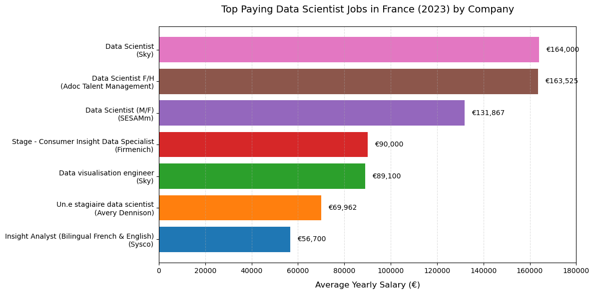
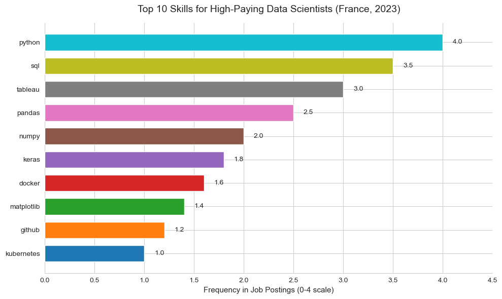
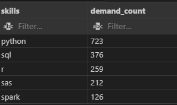
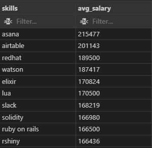
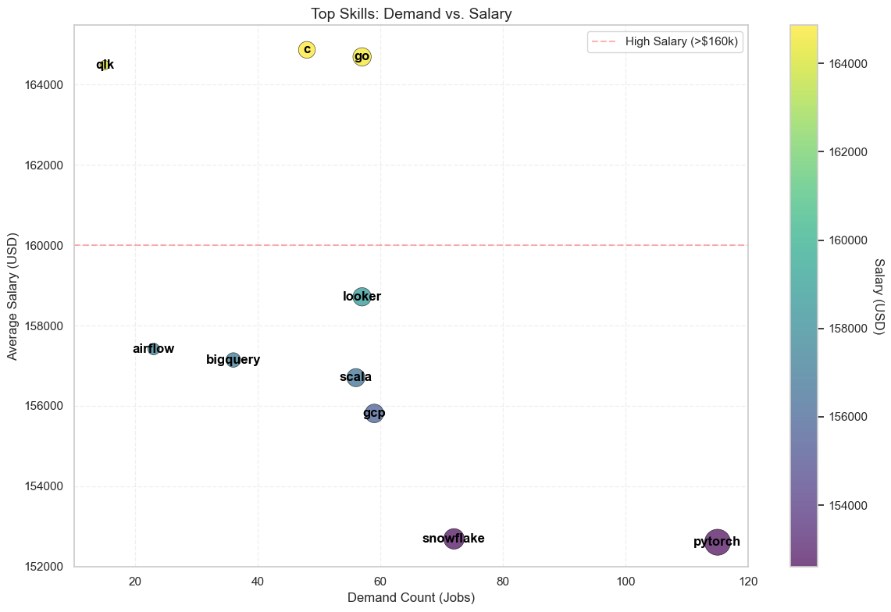

# Overview 
Dive into the data job market! Focusing on Data Scientist roles, this project explores top-paying jobs, in-demand skills, and where high demand meets high salary in data analytics.

Here are the SQL queries you'll find in my analysis [project_sql folder](/project_sql/).

# The Questions

Below are the questions i want to answer in my project:

- What are the top-paying data scientist jobs ?
- What skills are required for these top-paying jobs ?
- What skills are most in demand for data scientists ?
- Which skills are associated with higher salaries ?
- What are the most optimal skills to learn ?

# Tools I Used

For my deep dive into the data scientist job market, I harnessed the power of several key tools:

- SQL: The backbone of my analysis, allowing me to query the database and unearth critical insights.

- PostgreSQL: The chosen database management system, ideal for handling the job posting data.

- Visual Studio Code: My go-to for database management and executing SQL queries.

- Git & GitHub: Essential for version control and sharing my SQL scripts and analysis, ensuring collaboration and project tracking.

# The Analysis 

Each query for this project aimed at investigating specific aspects of the data scientist job market. Here’s how I approached each question:

### 1 Top Paying Data Scientist Jobs
To identify the highest-paying roles, I filtered data scientist positions by average yearly salary and location, focusing jobs located in France. This query highlights the high paying opportunities in the field.

```sql
SELECT	
	job_id,
	job_title,
	job_location,
	job_schedule_type,
	salary_year_avg,
	job_posted_date,
    name AS company_name
FROM
    job_postings_fact
LEFT JOIN company_dim ON job_postings_fact.company_id = company_dim.company_id
WHERE
    job_title_short = 'Data Scientist' AND 
    job_location = 'France' AND 
    salary_year_avg IS NOT NULL
ORDER BY
    salary_year_avg DESC
LIMIT 10;
```
Here's the breakdown of the top data scientist jobs in 2023:

- Data Scientist Roles Dominate High Salaries in France

    - The top 3 highest-paying jobs are all Data Scientist positions, with salaries ranging from €131,867 to €164,000. This highlights the strong demand and premium compensation for data science expertise in France.

- Internships ("Stage") Can Offer Competitive Salaries

    - Surprisingly, the "Stage - Consumer Insight Data Specialist" role pays €90,000, which is higher than some full-time roles like "Data Visualisation Engineer" (€89,100). This challenges the assumption that internships are always low-paid.

- Salary Disparity for Similar Roles

    - The title "Data Scientist" shows significant salary variation (€131,867 to €164,000), suggesting factors like company size, seniority, or additional skills (e.g., bilingual requirements) heavily influence compensation. For example, the bilingual "Insight Analyst" role pays significantly less (€56,700).


*Bar graph visualizing the salary for the top 7 salaries for data scientists in France in 2023*

### 2. Skills for Top Paying Jobs
To understand what skills are required for the top-paying jobs, I joined the job postings with the skills data, providing insights into what employers value for high-compensation roles.

```sql
WITH top_paying_jobs AS (
    SELECT	
        job_id,
        job_title,
        salary_year_avg,
        name AS company_name
    FROM
        job_postings_fact
    LEFT JOIN company_dim ON job_postings_fact.company_id = company_dim.company_id
    WHERE
        job_title_short = 'Data Scientist' AND 
        job_location = 'France' AND 
        salary_year_avg IS NOT NULL
    ORDER BY
        salary_year_avg DESC
    LIMIT 10
)

SELECT 
    top_paying_jobs.*,
    skills
FROM top_paying_jobs
INNER JOIN skills_job_dim ON top_paying_jobs.job_id = skills_job_dim.job_id
INNER JOIN skills_dim ON skills_job_dim.skill_id = skills_dim.skill_id
ORDER BY
    salary_year_avg DESC;
```
Here's the breakdown of the most demanded skills for the top 10 highest paying data scientist jobs in France in 2023:

- Python Dominance: Python is the most frequently mentioned skill in job postings, far surpassing other tools. This highlights its central role in data science workflows, likely due to its versatility, extensive libraries (like pandas and NumPy, which also appear on the list), and strong community support.

- Mix of Traditional and Modern Tools: While foundational skills like SQL (for data querying) and Tableau (for visualization) remain critical, newer technologies like Docker and Kubernetes (used for containerization and orchestration) are also in demand. This suggests that high-paying roles increasingly require data scientists to bridge traditional analytics with modern DevOps and cloud-native practices.

- Specialized Machine Learning Tools: The presence of Keras (a deep learning framework) indicates that expertise in advanced machine learning, particularly neural networks, is valued for high-paying positions. This contrasts with broader ML libraries like scikit-learn (not listed), pointing to a demand for deeper, specialized knowledge in cutting-edge AI techniques.



*Bar graph visualizing the count of skills for the top 10 paying jobs for data scientists*

### 3. In-Demand Skills for Data Scientists in France
This query helped identify the skills most frequently requested in job postings, directing focus to areas with high demand.

```sql
SELECT 
    skills,
    COUNT(skills_job_dim.job_id) AS demand_count
FROM job_postings_fact
INNER JOIN skills_job_dim ON job_postings_fact.job_id = skills_job_dim.job_id
INNER JOIN skills_dim ON skills_job_dim.skill_id = skills_dim.skill_id
WHERE
    job_title_short = 'Data Scientist' 
    AND job_location = 'France' 
GROUP BY
    skills
ORDER BY
    demand_count DESC
LIMIT 5;
```
Here's the breakdown of the most demanded skills for data scientists in 2023

- Python’s Overwhelming Dominance: With 723 mentions, Python is by far the most in-demand skill, more than doubling the demand for SQL (376). This reinforces Python’s role as the lingua franca of data science, likely due to its versatility in data analysis, machine learning, and automation.

- R vs. SAS: Open-Source vs. Legacy Tools: R (259) appears more frequently than SAS (212), suggesting a shift toward open-source tools in the data science field. However, SAS’s presence indicates that some industries (e.g., finance, healthcare) still rely on proprietary software, possibly due to compliance or legacy systems.

- Spark’s Niche but Growing Importance: While Spark (126) has fewer mentions compared to Python or SQL, its inclusion highlights the rising need for big data processing skills. This suggests that high-paying roles increasingly require distributed computing expertise as datasets grow in size and complexity.




*Table of the demand for the top 5 skills in data scientist job postings*

### 4. Skills Based on Salary
Exploring the average salaries associated with different skills revealed which skills are the highest paying (Data Scientist).

```sql
SELECT 
    skills,
    ROUND(AVG(salary_year_avg), 0) AS avg_salary
FROM job_postings_fact
INNER JOIN skills_job_dim ON job_postings_fact.job_id = skills_job_dim.job_id
INNER JOIN skills_dim ON skills_job_dim.skill_id = skills_dim.skill_id
WHERE
    job_title_short = 'Data Analyst'
    AND salary_year_avg IS NOT NULL
    AND job_work_from_home = True 
GROUP BY
    skills
ORDER BY
    avg_salary DESC
LIMIT 25;
```
Here's a breakdown of the results for top paying skills for Data Scientists:

- Niche Tools Command Premium Salaries: The top-paying skills—like Asana (project management, 215K),Airtable(201K), and RedHat (enterprise Linux, $189K)—are not traditional data science tools. This suggests that specialized or cross-functional expertise (e.g., DevOps, workflow automation) can significantly boost earning potential, even in data-centric roles.

- Emerging Tech and High Salaries: Skills like Watson (IBM’s AI platform, 187K) and Solidity (166K) highlight demand for cutting-edge technologies. Companies may pay a premium for professionals who combine data science with AI/ML or blockchain applications, reflecting industry trends toward these domains.

- Surprising High-Value Soft Skills: Tools like Slack (168K) and Ruby on Rails(166K) aren’t core data science skills but may indicate roles where collaboration (Slack) or full-stack development (Ruby on Rails) are highly valued. This implies that hybrid roles—blending data science with software engineering or team coordination are lucrative.



*Table of the average salary for the top 10 paying skills for data scientists*

### 5. Most Optimal Skills to Learn

Combining insights from demand and salary data, this query aimed to pinpoint skills that are both in high demand and have high salaries, offering a strategic focus for skill development.

```sql
WITH skills_demand AS (
    SELECT
        skills_dim.skill_id,
        skills_dim.skills,
        COUNT(skills_job_dim.job_id) AS demand_count
    FROM job_postings_fact
    INNER JOIN skills_job_dim ON job_postings_fact.job_id = skills_job_dim.job_id
    INNER JOIN skills_dim ON skills_job_dim.skill_id = skills_dim.skill_id
    WHERE
        job_title_short = 'Data Scientist' 
        AND salary_year_avg IS NOT NULL
        AND job_work_from_home = True 
    GROUP BY
        skills_dim.skill_id
), 

average_salary AS (
    SELECT 
        skills_job_dim.skill_id,
        ROUND(AVG(job_postings_fact.salary_year_avg), 0) AS avg_salary
    FROM job_postings_fact
    INNER JOIN skills_job_dim ON job_postings_fact.job_id = skills_job_dim.job_id
    INNER JOIN skills_dim ON skills_job_dim.skill_id = skills_dim.skill_id
    WHERE
        job_title_short = 'Data Scientist'
        AND salary_year_avg IS NOT NULL
        AND job_work_from_home = True 
    GROUP BY
        skills_job_dim.skill_id
)

SELECT
    skills_demand.skill_id,
    skills_demand.skills,
    demand_count,
    avg_salary
FROM
    skills_demand
INNER JOIN  average_salary ON skills_demand.skill_id = average_salary.skill_id
WHERE  
    demand_count > 10
ORDER BY
    avg_salary DESC,
    demand_count DESC
LIMIT 25;

SELECT 
    skills_dim.skill_id,
    skills_dim.skills,
    COUNT(skills_job_dim.job_id) AS demand_count,
    ROUND(AVG(job_postings_fact.salary_year_avg), 0) AS avg_salary
FROM job_postings_fact
INNER JOIN skills_job_dim ON job_postings_fact.job_id = skills_job_dim.job_id
INNER JOIN skills_dim ON skills_job_dim.skill_id = skills_dim.skill_id
WHERE
    job_title_short = 'Data Scientist'
    AND salary_year_avg IS NOT NULL
    AND job_work_from_home = True 
GROUP BY
    skills_dim.skill_id
HAVING
    COUNT(skills_job_dim.job_id) > 10
ORDER BY
    avg_salary DESC,
    demand_count DESC
LIMIT 25;
```

*Top-Paying Tech Skills & Their Job Market Popularity for Data Scientist in 2023*

Here's a breakdown of the most optimal skills for Data Scientists in 2023:

- High-Demand, High-Salary Skills:

    PyTorch stands out with the highest demand (115 jobs) and a competitive average salary ($152,603). This suggests strong industry demand for machine learning/AI expertise.

    Snowflake follows with 72 demand counts and a salary of $152,687, reflecting the growing need for cloud data warehousing skills.

- Niche Skills with Premium Salaries:

    Qlik has only 15 demand counts but offers the third-highest salary ($164,485). This implies scarcity of expertise drives higher pay for niche technologies.

- Go vs. Scala:

    Go and Scala have similar demand, but Go commands a ~$8k higher salary, possibly due to its rising popularity in cloud-native development.


# What I Learned

Throughout this adventure, I've turbocharged my SQL toolkit with some serious firepower:

- Advanced SQL Proficiency: Developed strong expertise in crafting complex queries, including multi-table joins and the effective use of WITH clauses to create temporary tables for streamlined data processing.

- Data Aggregation and Analysis: Applied GROUP BY and aggregate functions such as COUNT() and AVG() to summarize and interpret large datasets, supporting data-driven decision-making.

- Analytical Problem Solving: Translated real-world business questions into efficient and insightful SQL queries, delivering actionable insights and contributing to informed strategies.

# Conclusions

### Insights

From the analysis, several general insights emerged:

1. High-Demand Skills Command Premium Salaries : PyTorch and Snowflake exemplify how specialized skills in AI/ML and cloud data tools correlate with both high demand and competitive salaries.

2. Niche Skills Offer Salary Premiums Despite Lower Demand : QLK has only 15 job demands but the third-highest salary, suggesting scarcity drives value.

3. Go Outearns Scala Despite Similar Demand: Go and Scala with nearly identical demand highlights language-specific salary variations.

4. Cloud and Big Data Tools Dominate High-Paying Roles : GCP,BigQuery, and Snowflake reflect the premium on cloud/data engineering skills.

5. Salary Thresholds Reveal Skill Tiers : Skills like Go, QLK, and C is forming a "premium tier," while others (e.g., Looker, Airflow) cluster below.

### Closing Thoughts

This project enhanced my SQL skills and provided valuable insights into the data scientist job market. The findings from the analysis serve as a guide to prioritizing skill development and job search efforts. Aspiring data scientists can better position themselves in a competitive job market by focusing on high-demand, high-salary skills. This exploration highlights the importance of continuous learning and adaptation to emerging trends in the field of data science.

