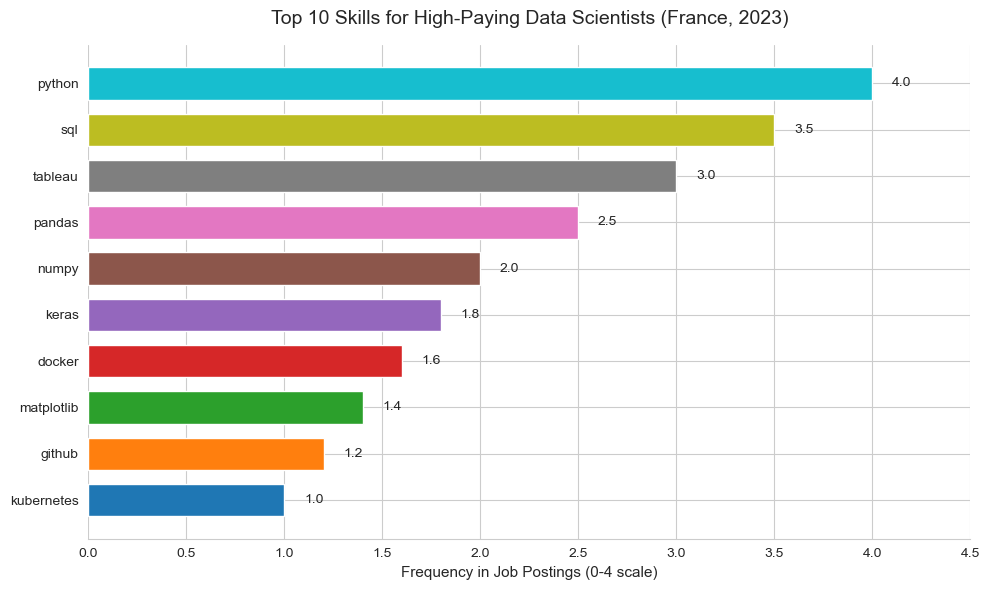
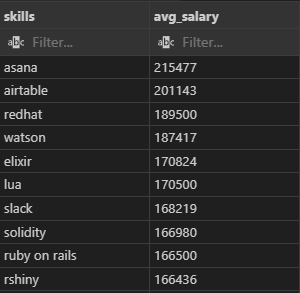
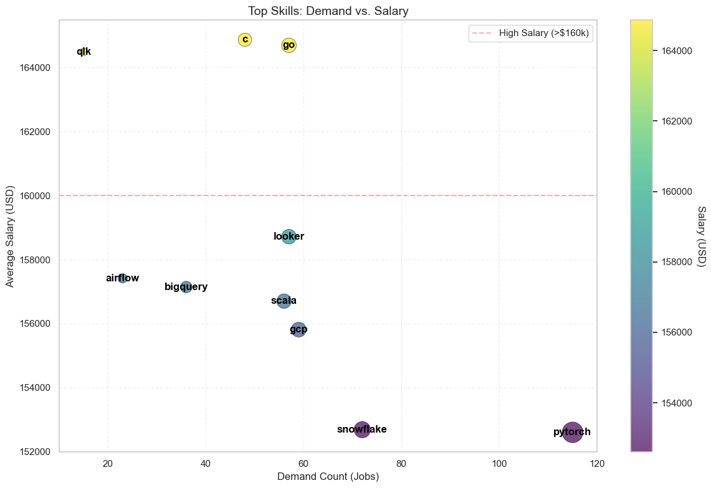

# Aperçu 
Plongez dans le marché de l'emploi dans le domaine de la data ! En se concentrant sur les rôles de Data Scientist, ce projet explore les métiers les mieux rémunérés, les compétences recherchées, et où la forte demande rencontre un salaire élevé dans l'analytique des données.

Voici les requêtes SQL que vous trouverez dans mon dossier [project_sql folder](/project_sql/).

# Les Questions

Voici les questions auxquelles je souhaite répondre dans mon projet :

- Quels sont les métiers de Data Scientist les mieux rémunérés ?
- Quelles compétences sont requises pour ces métiers les mieux rémunérés ?
- Quelles compétences sont les plus demandées pour les Data Scientists ?
- Quelles compétences sont associées à des salaires plus élevés ?
- Quelles sont les compétences les plus optimales à apprendre ?

# Outils Utilisés

Pour mon analyse approfondie du marché de l'emploi des Data Scientists, j'ai exploité la puissance de plusieurs outils clés :

- SQL : La base de mon analyse, me permettant d'interroger la base de données et de découvrir des informations cruciales.

- PostgreSQL : Le système de gestion de base de données choisi, idéal pour gérer les données des offres d'emploi.

- Visual Studio Code : Mon outil de prédilection pour la gestion de bases de données et l'exécution des requêtes SQL.

- Git & GitHub : Essentiels pour le contrôle de version et le partage de mes scripts SQL et analyses, garantissant la collaboration et le suivi du projet.

# L'Analyse

Chaque requête de ce projet visait à explorer des aspects spécifiques du marché de l'emploi des Data Scientists. Voici comment j'ai abordé chaque question :

### 1. Les Métiers de Data Scientist les Mieux Rémunérés

Pour identifier les rôles les mieux rémunérés, j'ai filtré les postes de Data Scientist en fonction du salaire annuel moyen et de la localisation, en me concentrant sur les emplois situés en France. Cette requête met en lumière les opportunités les mieux rémunérées dans ce domaine.

```sql
SELECT	
	job_id,
	job_title,
	job_location,
	job_schedule_type,
	salary_year_avg,
	job_posted_date,
    name AS company_name
FROM
    job_postings_fact
LEFT JOIN company_dim ON job_postings_fact.company_id = company_dim.company_id
WHERE
    job_title_short = 'Data Scientist' AND 
    job_location = 'France' AND 
    salary_year_avg IS NOT NULL
ORDER BY
    salary_year_avg DESC
LIMIT 10;
```
Voici la répartition des meilleurs emplois de Data Scientist en 2023 :

- Les Rôles de Data Scientist Dominent les Salaires Élevés en France

    - Les 3 métiers les mieux rémunérés sont tous des postes de Data Scientist, avec des salaires allant de 131 867 € à 164 000 $. Cela souligne la forte demande et la rémunération premium pour l'expertise en science des données en France.

- Les Stages Peuvent Offrir des Salaires Compétitifs

    - De manière surprenante, le rôle de "Stage - Consumer Insight Data Specialist" paie 90 000 $, ce qui est plus élevé que certains rôles à temps plein comme "Data Visualisation Engineer". Cela remet en question l'idée reçue selon laquelle les stages sont toujours mal rémunérés.

- Disparité Salariale pour des Rôles Similaires

    - Le titre "Data Scientist" montre une variation salariale importante (131 867 $ à 164 000 $), suggérant que des facteurs tels que la taille de l'entreprise, l'ancienneté ou des compétences supplémentaires (par exemple, les exigences bilingues) influencent fortement la rémunération. Par exemple, le rôle bilingue de "Insight Analyst" est payé beaucoup moins (56 700 $).


*Graphique à barres visualisant les salaires des 7 meilleurs salaires pour les data scientists en France en 2023.*

### 2. Compétences pour les Métiers les Mieux Rémunérés
Pour comprendre quelles compétences sont requises pour les emplois les mieux rémunérés, j'ai associé les offres d'emploi avec les données relatives aux compétences, afin de fournir des informations sur ce que les employeurs recherchent pour les rôles à rémunération élevée.

```sql
WITH top_paying_jobs AS (
    SELECT	
        job_id,
        job_title,
        salary_year_avg,
        name AS company_name
    FROM
        job_postings_fact
    LEFT JOIN company_dim ON job_postings_fact.company_id = company_dim.company_id
    WHERE
        job_title_short = 'Data Scientist' AND 
        job_location = 'France' AND 
        salary_year_avg IS NOT NULL
    ORDER BY
        salary_year_avg DESC
    LIMIT 10
)

SELECT 
    top_paying_jobs.*,
    skills
FROM top_paying_jobs
INNER JOIN skills_job_dim ON top_paying_jobs.job_id = skills_job_dim.job_id
INNER JOIN skills_dim ON skills_job_dim.skill_id = skills_dim.skill_id
ORDER BY
    salary_year_avg DESC;
```
Voici la répartition des compétences les plus demandées pour les 10 emplois les mieux rémunérés de Data Scientist en France en 2023 :

- Domination de Python : Python est la compétence la plus fréquemment mentionnée dans les offres d'emploi, surpassant largement les autres outils. Cela met en évidence son rôle central dans les workflows de la science des données, probablement en raison de sa polyvalence, de ses bibliothèques étendues (comme pandas et NumPy, qui figurent également sur la liste) et de son solide soutien communautaire.

- Mélange d'outils traditionnels et modernes : Bien que des compétences fondamentales comme SQL (pour l'interrogation des données) et Tableau (pour la visualisation) restent essentielles, des technologies plus récentes comme Docker et Kubernetes (utilisées pour la containerisation et l'orchestration) sont également demandées. Cela suggère que les rôles les mieux rémunérés exigent de plus en plus des Data Scientists qu'ils relient les analyses traditionnelles avec les pratiques modernes de DevOps et de cloud-native.

- Outils spécialisés en Machine Learning : La présence de Keras (un framework de deep learning) indique que l'expertise en machine learning avancé, notamment les réseaux neuronaux, est valorisée pour les postes les mieux rémunérés. Cela contraste avec des bibliothèques de ML plus larges comme scikit-learn (qui ne figure pas sur la liste), mettant en évidence une demande pour des connaissances plus approfondies et spécialisées dans les techniques d'IA de pointe.



*Graphique à barres visualisant le nombre de compétences pour les 10 métiers les mieux rémunérés de Data Scientist.*

### 3. Compétences les Plus Demandées pour les Data Scientists en France
Cette requête a permis d'identifier les compétences les plus fréquemment demandées dans les offres d'emploi, en dirigeant l'attention vers les domaines à forte demande. Voici la répartition des compétences les plus demandées pour les analystes de données en 2023 :

```sql
SELECT 
    skills,
    COUNT(skills_job_dim.job_id) AS demand_count
FROM job_postings_fact
INNER JOIN skills_job_dim ON job_postings_fact.job_id = skills_job_dim.job_id
INNER JOIN skills_dim ON skills_job_dim.skill_id = skills_dim.skill_id
WHERE
    job_title_short = 'Data Scientist' 
    AND job_location = 'France' 
GROUP BY
    skills
ORDER BY
    demand_count DESC
LIMIT 5;
```
Voici la répartition des compétences les plus demandées pour les data scientists en 2023.

- Dominance écrasante de Python : Avec 723 mentions, Python est de loin la compétence la plus demandée, dépassant largement la demande pour SQL (376). Cela renforce le rôle de Python en tant que lingua franca de la science des données, probablement en raison de sa polyvalence dans l'analyse de données, l'apprentissage automatique et l'automatisation.

- R vs. SAS : Open Source vs. Outils Hérités : R (259) apparaît plus fréquemment que SAS (212), suggérant un passage vers les outils open source dans le domaine de la science des données. Cependant, la présence de SAS indique que certaines industries (par exemple, la finance, la santé) dépendent encore des logiciels propriétaires, possiblement en raison de la conformité ou des systèmes hérités.

- L'Importance Croissante mais de Niche de Spark : Bien que Spark (126) ait moins de mentions que Python ou SQL, sa présence met en lumière le besoin croissant de compétences en traitement de big data. Cela suggère que les rôles les mieux rémunérés nécessitent de plus en plus une expertise en informatique distribuée à mesure que les ensembles de données grandissent en taille et en complexité.


*Tableau de la demande pour les 5 compétences principales dans les offres d'emploi de Data Scientist.*

### 4. Compétences en Fonction du Salaire
Explorer les salaires moyens associés à différentes compétences a permis de découvrir quelles compétences sont les mieux rémunérées (Data Scientist). Voici la répartition des résultats pour les compétences les mieux rémunérées pour les Analystes de Données :

```sql
SELECT 
    skills,
    ROUND(AVG(salary_year_avg), 0) AS avg_salary
FROM job_postings_fact
INNER JOIN skills_job_dim ON job_postings_fact.job_id = skills_job_dim.job_id
INNER JOIN skills_dim ON skills_job_dim.skill_id = skills_dim.skill_id
WHERE
    job_title_short = 'Data Analyst'
    AND salary_year_avg IS NOT NULL
    AND job_work_from_home = True 
GROUP BY
    skills
ORDER BY
    avg_salary DESC
LIMIT 25;
```
Voici la répartition des résultats pour les compétences les mieux rémunérées pour les Data Scientists :

- Les Outils de Niche Commandent des Salaires plus élevés : Les compétences les mieux rémunérées—comme Asana (gestion de projet, 215K), Airtable (201K), et RedHat (Linux d'entreprise, 189K)—ne sont pas des outils traditionnels de la science des données. Cela suggère que l'expertise spécialisée ou interfonctionnelle (par exemple, DevOps, automatisation des workflows) peut considérablement augmenter le potentiel de gains, même dans des rôles centrés sur les données.

- Technologies Émergentes et Salaires Élevés : Des compétences comme Watson (plateforme d'IA d'IBM, 187K) et Solidity (166K) soulignent la demande pour des technologies de pointe. Les entreprises peuvent offrir une prime pour les professionnels qui combinent la science des données avec l'IA/ML ou les applications blockchain, reflétant les tendances de l'industrie vers ces domaines.

- Soft Skills à Haute Valeur : Des outils comme Slack (168K) et Ruby on Rails (166K) ne sont pas des compétences de science des données essentielles, mais peuvent indiquer des rôles où la collaboration (Slack) ou le développement full-stack (Ruby on Rails) sont hautement valorisés. Cela implique que les rôles hybrides—combinant la science des données avec l'ingénierie logicielle ou la coordination d'équipe—sont lucratifs.



*Tableau du salaire moyen des 10 compétences les mieux rémunérées pour les Data Scientists.*

### 5. Compétences les Plus Optimales à Apprendre

En combinant les informations sur la demande et les salaires, cette requête visait à identifier les compétences qui sont à la fois très demandées et bien rémunérées, offrant ainsi un axe stratégique pour le développement des compétences.

```sql
WITH skills_demand AS (
    SELECT
        skills_dim.skill_id,
        skills_dim.skills,
        COUNT(skills_job_dim.job_id) AS demand_count
    FROM job_postings_fact
    INNER JOIN skills_job_dim ON job_postings_fact.job_id = skills_job_dim.job_id
    INNER JOIN skills_dim ON skills_job_dim.skill_id = skills_dim.skill_id
    WHERE
        job_title_short = 'Data Scientist' 
        AND salary_year_avg IS NOT NULL
        AND job_work_from_home = True 
    GROUP BY
        skills_dim.skill_id
), 

average_salary AS (
    SELECT 
        skills_job_dim.skill_id,
        ROUND(AVG(job_postings_fact.salary_year_avg), 0) AS avg_salary
    FROM job_postings_fact
    INNER JOIN skills_job_dim ON job_postings_fact.job_id = skills_job_dim.job_id
    INNER JOIN skills_dim ON skills_job_dim.skill_id = skills_dim.skill_id
    WHERE
        job_title_short = 'Data Scientist'
        AND salary_year_avg IS NOT NULL
        AND job_work_from_home = True 
    GROUP BY
        skills_job_dim.skill_id
)

SELECT
    skills_demand.skill_id,
    skills_demand.skills,
    demand_count,
    avg_salary
FROM
    skills_demand
INNER JOIN  average_salary ON skills_demand.skill_id = average_salary.skill_id
WHERE  
    demand_count > 10
ORDER BY
    avg_salary DESC,
    demand_count DESC
LIMIT 25;

SELECT 
    skills_dim.skill_id,
    skills_dim.skills,
    COUNT(skills_job_dim.job_id) AS demand_count,
    ROUND(AVG(job_postings_fact.salary_year_avg), 0) AS avg_salary
FROM job_postings_fact
INNER JOIN skills_job_dim ON job_postings_fact.job_id = skills_job_dim.job_id
INNER JOIN skills_dim ON skills_job_dim.skill_id = skills_dim.skill_id
WHERE
    job_title_short = 'Data Scientist'
    AND salary_year_avg IS NOT NULL
    AND job_work_from_home = True 
GROUP BY
    skills_dim.skill_id
HAVING
    COUNT(skills_job_dim.job_id) > 10
ORDER BY
    avg_salary DESC,
    demand_count DESC
LIMIT 25;
```

*Compétences technologiques les mieux rémunérées et leur popularité sur le marché de l'emploi pour les Data Scientists en 2023.*

Voici la répartition des compétences les plus optimales pour les Data Scientists en 2023 :

- Compétences à Forte Demande et Bien Rémunérées :

    PyTorch se distingue avec la plus forte demande (115 offres) et un salaire moyen compétitif (152 603 $). Cela suggère une forte demande de l'industrie pour l'expertise en apprentissage automatique/IA.

    Snowflake suit avec 72 demandes et un salaire de 152 687 $, ce qui reflète le besoin croissant de compétences en stockage de données cloud.

- Compétences de Niche avec des Salaires Premium :

    Qlik a seulement 15 demandes, mais offre le troisième salaire le plus élevé (164 485 $). Cela implique que la rareté de l'expertise entraîne une rémunération plus élevée pour les technologies de niche.

- Go vs. Scala:

    Go et Scala ont une demande similaire, mais Go un salaire environ 8 000 $ plus élevé, probablement en raison de sa popularité croissante dans le développement cloud-native.


# Ce que j'ai appris

Tout au long de ce projet, j'ai renforcé ma boîte à outils SQL avec de puissantes compétences :

- Compétence SQL Avancée : Développement d'une expertise solide dans la création de requêtes complexes, y compris les jointures multi-tables et l'utilisation efficace des clauses WITH pour créer des tables temporaires pour un traitement de données plus fluide.

- Agrégation et Analyse des Données : Application de GROUP BY et de fonctions agrégées comme COUNT() et AVG() pour résumer et interpréter de grands ensembles de données, soutenant la prise de décisions basée sur les données.

- Résolution Analytique des Problèmes : Traduction des questions commerciales réelles en requêtes SQL efficaces et perspicaces, fournissant des informations exploitables et contribuant à des stratégies éclairées.

# Conclusions

### Aperçus

De l'analyse, plusieurs points sont à retenir :

1. Les Compétences Très Demandées Commandent des Salaires plus élevés : PyTorch et Snowflake exemplifient comment les compétences spécialisées en IA/ML et en outils de données cloud sont corrélées avec une forte demande et des salaires compétitifs.

2. Les Compétences de Niche Offrent des Salaires plus élevés Malgré une Demande Plus Faible : Qlik n'a que 15 demandes d'emploi mais le troisième salaire le plus élevé, suggérant que la rareté augmente la valeur.

3. Go Surpasse Scala Malgré une Demande Similaire : Go et Scala, avec une demande presque identique, mettent en évidence des variations salariales spécifiques aux langages.

4. Les Outils Cloud et Big Data Dominent les Rôles Très Rémunérés : GCP, BigQuery et Snowflake reflètent la prime accordée aux compétences en cloud et en ingénierie des données.

5. Les Seuils de Salaire est Révelateur des Niveaux de Compétence : Des compétences comme Go, Qlik et C forment un « niveau premium », tandis que d'autres (comme Looker, Airflow) se regroupent en dessous.

### Réflexions Finales

Ce projet a renforcé mes compétences en SQL et m'a fourni des informations précieuses sur le marché de l'emploi des Data Scientists. Les résultats de l'analyse servent de guide pour prioriser le développement des compétences et les efforts de recherche d'emploi. Les Data Scientists en devenir peuvent mieux se positionner sur un marché du travail compétitif en se concentrant sur des compétences très demandées et bien rémunérées. Cette exploration met en lumière l'importance de l'apprentissage continu et de l'adaptation aux tendances émergentes dans le domaine de la science des données.
